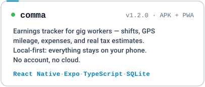
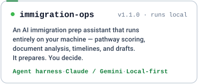

  

  

  

  

---

  

---

  

  
  

  
    <a href="https://github.com/raiz-toff/starlight-fumadocs"><code>starlight-fumadocs</code></a>
    &nbsp;·&nbsp;
    <a href="https://github.com/raiz-toff/starlight-glide"><code>starlight-glide</code></a>
    &nbsp;·&nbsp;
    <a href="https://github.com/raiz-toff/jobtracker"><code>jobtracker</code></a>
  

---

  
  &nbsp;&nbsp;
  
  &nbsp;&nbsp;
  

